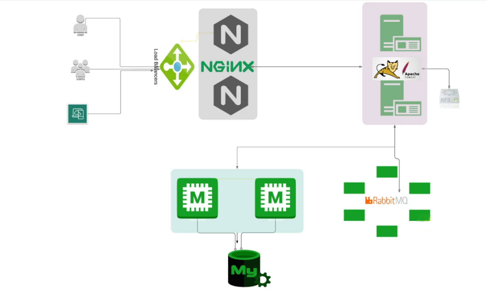
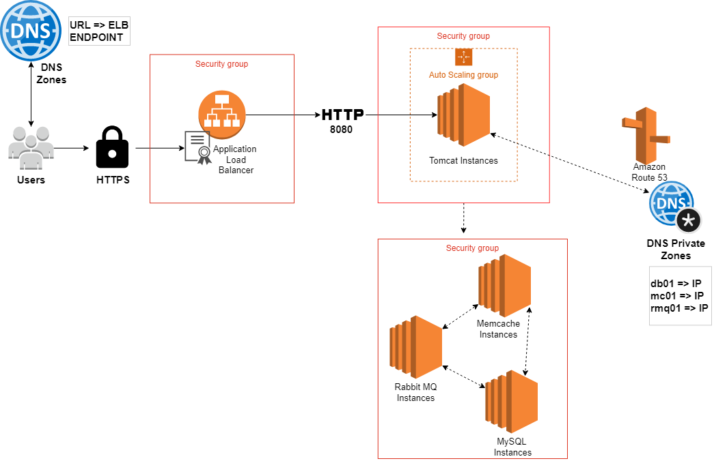

# AWS Cloud for Web App Setup [Lift & Shift]

## About the Project
- Multi Tier Web Application Stack. 
- Host & Run on AWS Cloud for production. 
- Lift & Shift Strategy.

## Problem 
- Complex Management 
- Scale Up/Down complexity
- UpFront CapEx & Regular OpEx
- Manual Process
- Difficult to automate
- Time consuming

## Solution
- Automation
- PayAsYouGo
- IAAS
- Flexibility

## AWS Services 
- Ec2 Instances => (VM for Tomcat, RabbitMQ, Memcache, MySQL)
- ELB [Load Balancer] => (Nginx LB Replacement)
- Autoscaling => (Automation for VM Scaling)
- S3/EFS Storage => (Shared Storage)
- Route 53 => (Private DNS service)

## Objective
- Flexible Infra
- No Upfront cost
- Modernize Effectively
- IAAC
  
## Architecture of AWS services for the project
- Ec2 Instances
- ELB
- Autoscaling
- S3/EFS Storage
- Amazon Certificate manage
- Rout 53

## Flow of Execution
1. Login to AWS Account
2. Create Key Pairs
3. Create Security groups
4. Launch Instances with user data [BASH Scripts]
5. Update IP to name mapping in Route 53
6. Build Application from source code
7. Upload to S3 bucket
8. Download artifact to Tomcat Ec2 Instance
9. Setup ELB with HTTPS [Cert from Amazon Certificate Manager]
10. Map ELB Endpoint to website name in DNS
11. Verify
12. Build Autoscaling Group for Tomcat Instances.